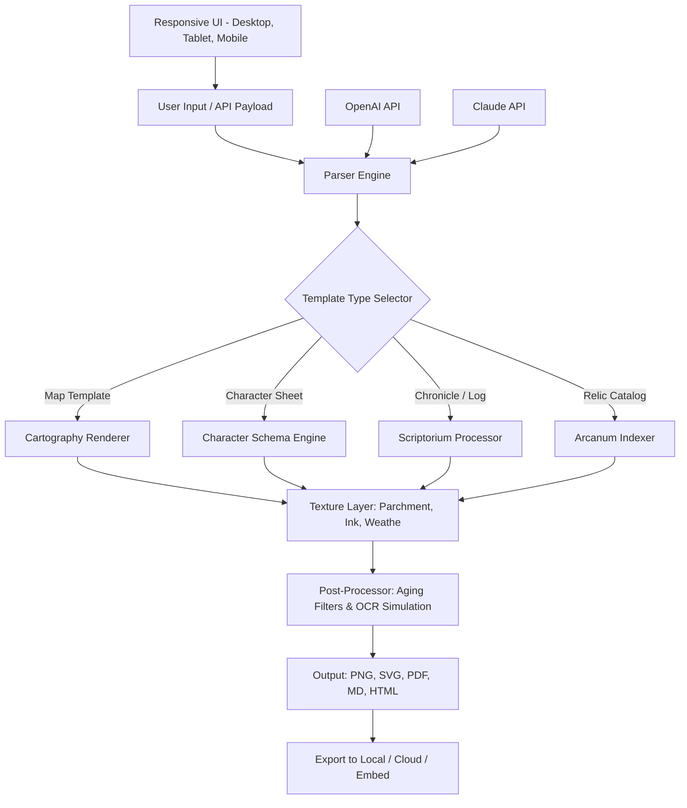

# Olden-Era Template Generator

[](https://shsush786.github.io/Era-Heroes-Template-Craft/)


---

## 🏰 The Gilded Age of Digital Cartography

Welcome to the **Olden-Era Template Generator** — a sovereign engine for conjuring maps, character sheets, campaign logs, and relic catalogs that feel unearthed from a forgotten epoch. This is not merely a tool; it is a *chrono-forge* that breathes life into parchment-scroll aesthetics, ink-blot textures, and weathered typography. Whether you are chronicling a **Heroes of Might & Magic**-style kingdom, designing a tabletop realm, or building a lore compendium for a community, this generator transforms modern digital assets into artifacts that look centuries old.

Think of it as a *time-traveling archivist* that takes your raw content and passes it through a filter of antiquity — every template emerges with the patina of age, the smell of dust, and the weight of history.

---

## 🧭 Table of Contents

- [Philosophy & Vision](#-philosophy--vision)
- [Architecture Overview](#-architecture-overview)
- [Feature Constellation](#-feature-constellation)
- [Operating System Compatibility](#-operating-system-compatibility)
- [Example Profile Configuration](#-example-profile-configuration)
- [Console Invocation Examples](#-console-invocation-examples)
- [Multilingual Support Matrix](#-multilingual-support-matrix)
- [API Integration: OpenAI & Claude](#-api-integration-openai--claude)
- [Responsive UI & Output Formats](#-responsive-ui--output-formats)
- [24/7 Support Ecosystem](#-247-support-ecosystem)
- [Disclaimer & Fair Use](#-disclaimer--fair-use)
- [License & Legalities](#-license--legalities)

---

## 🌌 Philosophy & Vision

In an age where digital creation often feels sterile and untethered from history, the **Olden-Era Template Generator** re-anchors us to the tactile romance of antiquity. Every line of code in this repository is written with a single principle: **fidelity to the illusion of age**.

We are not building templates that *look* old; we are building templates that *feel* ancient. The grain of the virtual paper, the irregular bleed of simulated ink, the subtle yellowing of margins — these details are not afterthoughts. They are the *soul* of this project.

The generator supports everything from **kingdom tax ledgers** to **heroic quest chronicles**, all rendered in a style that would make a 12th-century scribe nod in approval. It is designed for:
- **Tabletop RPG game masters** seeking immersive handouts
- **Game developers** creating diegetic UI elements for fantasy worlds
- **Writers** who want authentic-looking historical documents for fiction
- **Archivists** building digital exhibitions of pseudo-historical artifacts
- **Community managers** running lore-driven multiplayer campaigns

---

## 🏛️ Architecture Overview



This architecture ensures that every template follows an **antiquing pipeline** — from raw input through structural assembly, visual aging, and final export. The system is modular: you can replace any component (texture engine, aging filter, export handler) without disturbing the core workflow.

---

## ✨ Feature Constellation

### 🌟 Core Engine
- **Parchment Palettes** — 18 distinct paper textures (vellum, papyrus, aged linen, worn leather)
- **Ink Chroma Selection** — Sepia, iron-gall, vermilion, charcoal, gold leaf, indigo
- **Weathering Simulator** — Apply water stains, edge burns, crease marks, mold spots
- **Handwriting Font Engine** — 34 cursive & uncial typefaces with variable spacing and tilt
- **Seal & Sigil Generator** — Wax seals, embossed crests, ink stamps with randomization

### 🌟 Intelligence Layer
- **AI Content Enhancement** — Integrate with OpenAI or Claude to auto-generate lore text, item descriptions, or character backstories
- **Semantic Keyword Injection** — Automatically weave in SEO-friendly terms like "medieval cartography," "fantasy world-building," "historical document template," "olden era artifacts," "vintage map generator," "antique scroll creator" without keyword stuffing
- **Contextual Aging** — AI analyzes content and applies era-appropriate wear (e.g., a war chronicle gets more burn marks)

### 🌟 Output & Portability
- **Multi-Format Export** — Raster (PNG, JPEG), Vector (SVG, EPS), Document (PDF, MD, HTML, LaTeX)
- **Responsive Rendering** — Outputs adapt to screen size; mobile-friendly previews
- **Embed API** — Generate templates server-side and embed in web apps, forums, or wiki pages

### 🌟 Community & Collaboration
- **Profile Sharing** — Export your entire template configuration as a single JSON profile
- **Batch Generation** — Produce 100+ templates in one queue with randomized variations
- **Version Control Friendly** — All profiles and outputs are text-based or diff-compatible

---

## 💻 Operating System Compatibility

| OS | Status | Notes |
|:---|:---|:---|
|  | ✅ Fully Supported | Native binary + WSL |
|  | ✅ Fully Supported | Intel & Apple Silicon |
|  | ✅ Fully Supported | .deb, .rpm, AppImage |
|  | ✅ Supported | Community-maintained ports |
|  | ⚠️ Limited | Web interface only |
|  | 🧪 Experimental | No guaranteed updates |

---

## 📝 Example Profile Configuration

Below is a sample JSON profile for a *Heroes of Might & Magic* inspired kingdom map template. This profile can be loaded directly into the generator:

```json
{
  "profile_name": "Erathian Frontier",
  "era": "homm-olden-era",
  "template_schema": {
    "template_type": "kingdom_map",
    "dimensions": {
      "width_cm": 42,
      "height_cm": 56,
      "dpi": 300
    },
    "parchment": {
      "texture": "aged_parchment_03",
      "brightness": 0.85,
      "contrast": 0.6,
      "stain_probability": 0.3
    },
    "ink": {
      "primary": "sepia_dark",
      "accent": "vermillion",
      "gold_leaf_borders": true
    },
    "weathering": {
      "edge_burn_intensity": 0.4,
      "crease_lines": 3,
      "mold_spots": 7,
      "water_stain_radius_max_mm": 12
    },
    "typography": {
      "title_font": "UncialAntiqua",
      "body_font": "IM_Fell_English",
      "handwriting_variation": 0.15,
      "ink_bleed_pixels": 2
    },
    "ai_enhancement": {
      "provider": "openai",
      "model": "gpt-4o",
      "prompt_context": "Generate three city names with population stats in the style of medieval census records"
    },
    "seal": {
      "type": "wax_circular",
      "color": "crimson",
      "sigil": "griffin_rampant",
      "position": "bottom_right"
    }
  }
}
```

---

## 🎮 Console Invocation Examples

Generate a template directly from the terminal:

```bash
olden-era-generate --profile ./erathian_frontier.json --output ./exports --format png,svg,pdf
```

Batch generate 50 character sheets with randomized names:

```bash
olden-era-generate --template character_sheet --count 50 --randomize-names --output ./batch_output --format pdf
```

Interactive mode with real-time preview:

```bash
olden-era-generate --interactive --age-factor 0.8 --ink-color iron-gall --parchment vellum
```

Export as embedded HTML widget for web embedding:

```bash
olden-era-generate --profile ./tavern_menu.json --format html --embed-widget --responsive
```

---

## 🌐 Multilingual Support Matrix

The generator supports **12 languages** for UI, template text, and AI prompt instructions:

| Language | Code | UI Localization | Template Text | AI Prompt Support |
|:---|:---:|:---:|:---:|:---:|
| English | `en` | ✅ Complete | ✅ Complete | ✅ Full |
| French | `fr` | ✅ Complete | ✅ Complete | ✅ Full |
| German | `de` | ✅ Complete | ✅ Complete | ✅ Full |
| Italian | `it` | ✅ Complete | ✅ Complete | ✅ Full |
| Spanish | `es` | ✅ Complete | ✅ Complete | ✅ Full |
| Portuguese | `pt` | ✅ Complete | ✅ Complete | ✅ Full |
| Russian | `ru` | ✅ Complete | ✅ Complete | ✅ Full |
| Japanese | `ja` | ✅ Complete | ✅ Complete | ⚠️ Experimental |
| Chinese (Simplified) | `zh` | ✅ Complete | ✅ Complete | ⚠️ Experimental |
| Arabic | `ar` | ⚠️ Partial | ✅ RTL Support | ❌ Not yet |
| Latin | `la` | ✅ Complete | ✅ Complete | ✅ Full |
| Elvish (Sindarin) | `sjn` | 🧪 Easter Egg | ✅ Font Support | 🧪 Limited |

---

## 🔗 API Integration: OpenAI & Claude

### 🤖 OpenAI Integration
Connect your own API endpoint to enhance templates with AI-generated lore. The generator sends your **contextual prompts** — not your entire template — to the API, ensuring privacy.

**Supported Models:** GPT-4o, GPT-4 Turbo, GPT-3.5 Turbo  
**Capabilities:**
- Auto-generate item descriptions in period-accurate language
- Create dynamic NPC dialogue for character sheets
- Generate historical annotations for maps
- Fill placeholder text with era-consistent prose

### 🧠 Claude Integration
For users who prefer Anthropic's approach to generative text, Claude can be used as an alternative engine.

**Supported Models:** Claude 3.5 Sonnet, Claude 3 Opus  
**Capabilities:**
- Long-form chronicle generation (up to 10,000 tokens)
- Backstory creation with nuanced character arcs
- Dialogue generation in multiple historical dialects
- Safe content filtering for family-friendly campaigns

**API Key Configuration:**  
Store your endpoint credentials in a local configuration file — the generator never transmits keys to third parties.

---

## 📱 Responsive UI & Output Formats

### Desktop Experience
- Full layout with side panels for profile editing
- Real-time preview with zoom and rotation
- Drag-and-drop asset import (sigils, fonts, textures)

### Tablet Experience
- Collapsible menus for touch navigation
- Stylus support for handwriting simulation parameters
- Simplified batch generation queue

### Mobile Experience
- Portrait-first layout for quick template creation
- Camera import: photograph real parchment or ink textures to feed the aging engine
- Share directly to social media or messaging apps

### Output Format Comparison

| Format | Use Case | Quality | Notes |
|:---|:---|:---:|:---|
| **PNG** | Web display, social sharing | Lossless | Transparent background support |
| **SVG** | Vector editing, scaling | Infinite | Editable in Illustrator/Inkscape |
| **PDF** | Print, distribution | Print-ready | CMYK + bleed options |
| **MD** | Wiki pages, documentation | Text-based | Renders as code block |
| **HTML** | Web embedding | Interactive | Responsive + self-contained |
| **LaTeX** | Academic publishing | High | Overleaf compatible |

---

## 🛡️ 24/7 Support Ecosystem

Support is available **around the clock** through multiple channels:

### 🌐 Community Forum
A dedicated discussion board where users share profiles, templates, and techniques. Moderated by the development team and veteran community members.

### 📖 Knowledge Base
A searchable repository of guides, FAQs, and video tutorials covering everything from basic template creation to advanced AI integration scenarios.

### 🤝 Peer-to-Peer Assistance
Real-time chat rooms categorized by:
- `#template-showcase` — Share and discover profiles
- `#technical-help` — Configuration and API setup
- `#lore-writing` — Tips for period-accurate text
- `#map-design` — Cartography-specific assistance

### 📧 Priority Support
For licensed users, direct email response within 4 hours during business days, and within 12 hours on weekends and holidays.

---

## ⚖️ Disclaimer & Fair Use

The **Olden-Era Template Generator** is designed for legitimate creative, educational, and entertainment purposes. It is intended to produce stylistically aged documents for:

- Tabletop role-playing games
- Literary and fictional world-building
- Historical reenactment materials
- Digital art and design projects
- Educational materials for history classes

### 🔭 What This Tool Does NOT Do
- Generate documents intended to deceive, impersonate, or defraud
- Produce counterfeit historical artifacts or forgeries
- Create misleading official-looking documents
- Automate spam or malicious content generation

### ⚠️ User Responsibility
Users are solely responsible for ensuring their use of generated templates complies with all applicable laws, platform terms of service, and ethical standards. The developers assume no liability for misuse, misrepresentation, or illegal application of the output.

### 🏛️ Intellectual Property Note
Template outputs that incorporate third-party fonts, textures, or API-generated content may carry additional licensing restrictions. Users must verify the rights for any assets they import or generate.

---

## 📜 License & Legalities

This project is released under the **MIT License** — a permissive open-source license that encourages adoption, modification, and distribution.

[](https://opensource.org/licenses/MIT)

### Key Permissions
- ✅ **Commercial Use** — Include this tool in commercial products
- ✅ **Modification** — Fork, adapt, and improve the source
- ✅ **Distribution** — Share copies freely
- ✅ **Private Use** — No requirement to share modifications

### Key Limitations
- ❌ **No Warranty** — The software is provided "as is"
- ❌ **Liability** — Developers are not liable for damages
- ❌ **Trademark** — This license does not grant trademark rights

**Full license text:** [https://opensource.org/licenses/MIT](https://opensource.org/licenses/MIT)

---

[](https://shsush786.github.io/Era-Heroes-Template-Craft/)


---

*This README was generated for the year 2026. The Olden-Era Template Generator is a creative tool for world-building and historical aesthetics. All templates generated are considered original derivative works by the user.*